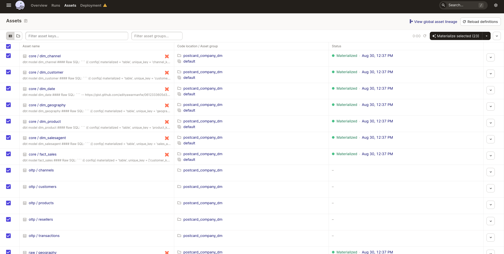
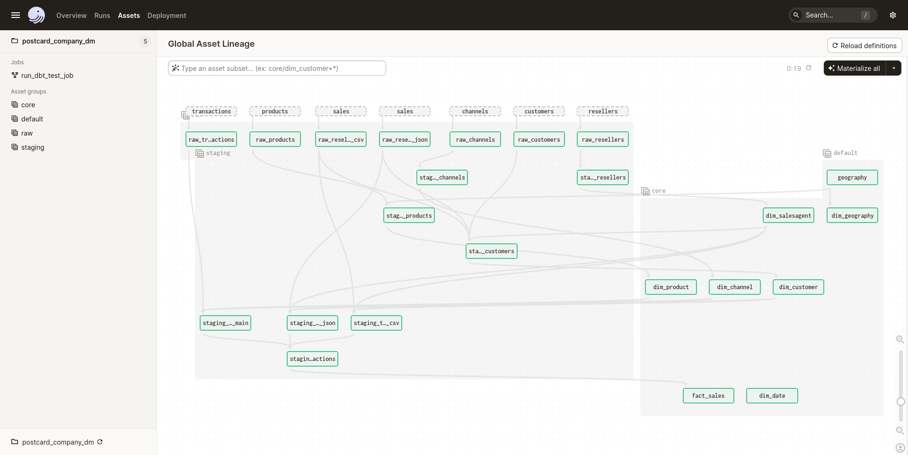
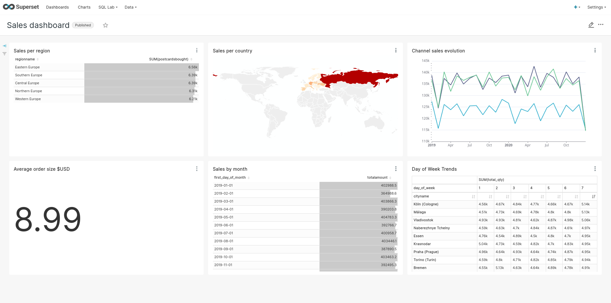

# Portable Data Stack

This application is an Analytics suite suite for an imaginary company selling postcards. The company sells both directly but also through resellers in the majority of European countries.

## Stack

- Dagster
- Docker & Docker-Compose
- DuckDB
- dbt core
- Superset

### System requirements
* [Docker](https://docs.docker.com/engine/install/)
* [Docker-Compose](https://docs.docker.com/compose/install/)

## Setup

1. Rename `.env.example` file to `.env` and set your desired password. Remember to never commit files containing passwords or any other sensitive information.

2. Rename `shared/db/datamart.duckdb.example` to `shared/db/datamart.duckdb` or init an empty database file there with that name.

3. With **Docker engine** and **Docker-Compose** installed, change directory to the root folder of the project (also the one that contains docker-compose.yml) and run

    `docker-compose up --build`

4. Once the Docker suite has finished loading, open up [Dagster (dagit)](http://localhost:3000) , go to `Assets`, select all and click `Materialize selected`

5. When the assets have been materialized, you can open the [Superset interface](http://localhost:8088)

### Demo Credentials

Demo credentials are set in the .env file mentioned above. 

### Ports exposed locally
* Dagster (dagit): 3000
* Superset: 8088
* PosgreSQL OLTP Database instance: 54320

Generated flat files (JSON, CSV) are saved in the **shared** folder.

The data is fictional and automatically generated. Any similarities with existing persons, entities, products or businesses are purely coincidental.

### General flow

1. Generate test data (flat files + OLTP data) using Python
2. Import flat file data and OLTP data to staging area in the Data Warehouse (DuckDB), orchestrated by Dagster
3. Model data, build fact and dimension tables, load the Data Warehouse using dbt
    - installs dbt dependencies
    - seeds the database with static data (e.g. geography)
    - runs the model
    - tests the model
4. Analyze and visually explore the data using Superset or directly query the Data Warehouse database instance

For superset, the default credentials are: user = admin, password = admin

## Overview of architecture

The docker-compose process will begin building the application suite. The suite is made up of the following components, each within its own docker container:
* **generator**: this is a collection of Python scripts that will generate, insert and export the example data
* **oltp**: this is the PostgreSQL instance that will simulate our transactional database (**sales_oltp**), serving as one of the sources of the data; this is locally available on the host machine exposed on port 54320.
* **dagster_dbt**: this is the orchestrator tool that will trigger the ETL tasks; its GUI is locally available on port 3000; 
* **superset**: this contains the web-based Business Intelligence application we will use to explore the data; exposed on port 8088.

Once the docker-compose building process has completed, we may open the Dagster (dagit) GUI (locally: localhost:3000) to view the orchestration of our tasks.

After the DAGs have completed you can either analyze the data using the querying and visualization tools provided by Superset (available locally on port 8088), or query the Data Warehouse (available as a DuckDB Database)

## Credits

Inspired by:
- [Build a poor man’s data lake from scratch with DuckDB](https://dagster.io/blog/duckdb-data-lake)
- [Using dbt with Dagster software-defined assets](https://docs.dagster.io/integrations/dbt/using-dbt-with-dagster)